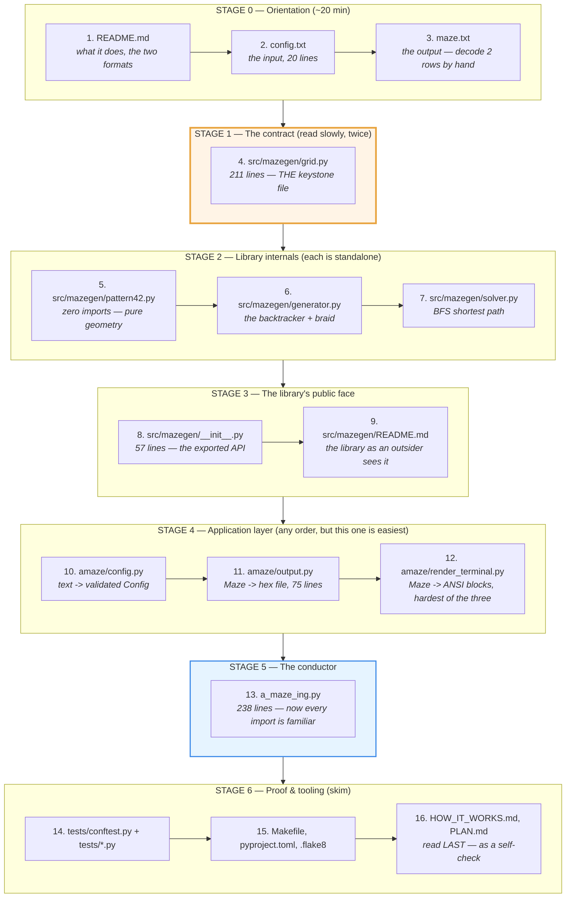
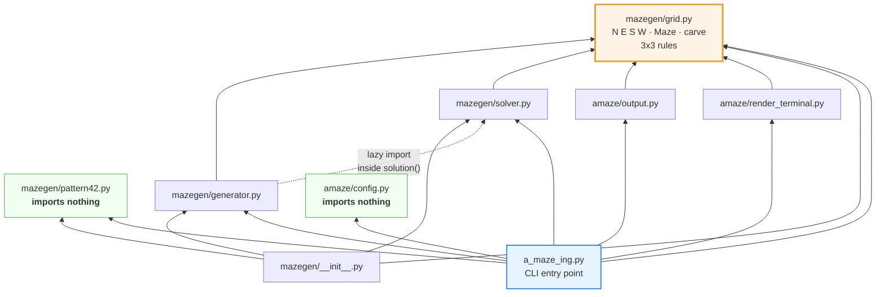
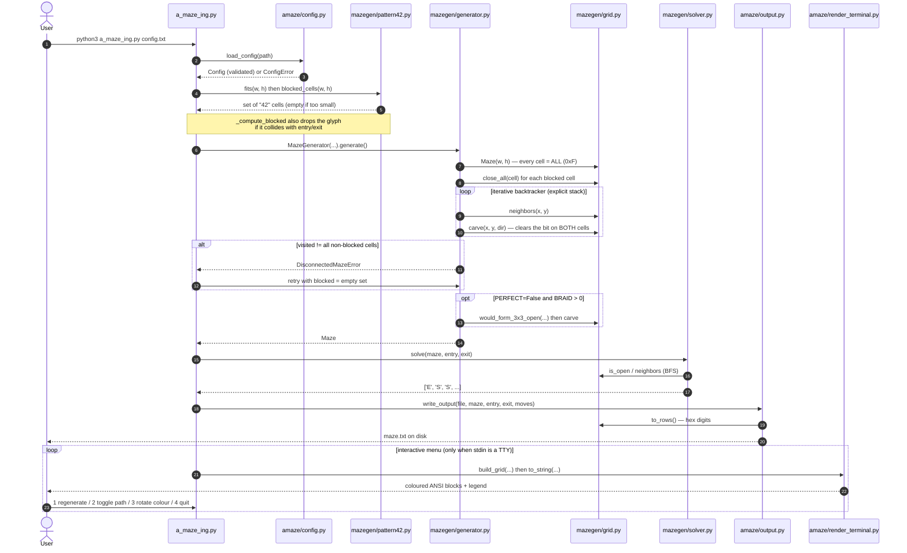
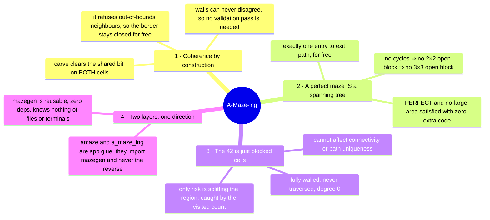

# A-Maze-ing — Code Reading Guide

A sequential path through the codebase (~2 100 lines, 12 source files) that
never asks you to read a file before the one it depends on.

**The rule that shapes the order:** everything in this project is built on
one shared contract — the 4-bit wall mask in `mazegen/grid.py`. Read that
contract once, and every other file becomes a small, obvious consumer of it.
Read anything else first and you will be reverse-engineering the contract
from its consumers.

---

## 1. The reading order

---

## 2. Why this order — the real dependency graph

Arrows mean *"imports from"*. Notice `grid.py` has **no** outgoing arrows and
**five** incoming ones: that is why it is step 4 and not step 12.

Two files (green) import nothing from the project — `pattern42.py` and
`config.py` are safe to read at any point if you get stuck elsewhere.

The dotted arrow is deliberate: `generator.solution()` imports the solver
*inside the function body* (`generator.py:173`) to avoid an import cycle.
Worth noticing on your first pass.

---

## 3. What one run actually does

Read this **after stage 5** — it is the map that `a_maze_ing.py:main()` walks.

---

## 4. File-by-file: what to look for

### Stage 0 — Orientation

| # | File | Time | What to extract |
|---|------|------|-----------------|
| 1 | `README.md` | 10 min | The two file formats (config in, hex out) and the wall-bit table. Skip "Algorithm" for now. |
| 2 | `config.txt` | 2 min | 6 mandatory keys, 5 optional. Note `WIDTH=50 HEIGHT=50 PERFECT=False`. |
| 3 | `maze.txt` | 5 min | **Do this by hand:** take the first digit, write it in binary, name the closed walls. Then find the blank line and the 3 trailing lines. This single exercise makes stages 1–4 trivial. |

### Stage 1 — The contract ⭐

**`src/mazegen/grid.py` (211 lines)** — budget real time here; everything else
is downstream.

| Lines | Symbol | Why it matters |
|-------|--------|----------------|
| 23–27 | `N=1 E=2 S=4 W=8`, `ALL=15` | The bit convention the whole project speaks. **Memorise it.** |
| 30–41 | `OPPOSITE`, `DELTA`, `LETTER` | Note `DELTA[N] = (0,-1)` — **y grows downward**. Every off-by-one confusion later traces back to this. |
| 67–72 | `Maze.__init__` | Cells live in a flat `bytearray`, all starting at `ALL`. Everything starts fully walled; generation only ever *removes* walls. |
| **101–116** | **`carve()`** | The heart of the project. It clears the bit on **both** neighbours, which is why the two sides of a wall can never disagree. And it refuses out-of-bounds neighbours — that single `raise` is what keeps the outer border permanently closed. |
| 119–125 | `neighbors()` | The only way anyone walks the grid. |
| 131–203 | the 3×3 machinery | Skim on pass 1; return on pass 2. `_canonical_edge` exists so each physical edge has exactly one name (top/left owner, `E` or `S` only). `would_form_3x3_open` is the constant-time version used during braiding. |
| 206–211 | `to_rows()` | Where the output-file format is actually produced. |

**Pass-2 question to answer before moving on:** why can a perfect maze never
contain a 3×3 open block, without any check at all? (README lines 135–145
confirm your answer.)

### Stage 2 — Library internals

**`src/mazegen/pattern42.py` (123 lines)** — the easiest file in the repo, and
it imports nothing.
- 20–38: two 3×5 bitmaps zipped into one 7×5 glyph. Read the `1`/`0` rows as ASCII art.
- 49–60: `min_dimensions()` → a constant `(7 + 2, 5 + 2)` = `(9, 7)`; the `+2` is the one-cell margin.
- 74–101: `blocked_cells()` centres the glyph, one cell per font pixel. The glyph size is fixed — a bigger maze gets the same "42" with more margin, never a bigger one.
- Key insight: this module returns **coordinates only**. It knows nothing about mazes. That is the whole reason the "42" never breaks connectivity logic.

**`src/mazegen/generator.py` (175 lines)**
- 50–91: constructor = pure validation. Notice it re-checks bounds itself rather than trusting `Config`.
- **93–134: `generate()`** — the iterative backtracker. Read it as four beats: mark blocked cells closed → push `entry` → repeatedly pick a random unvisited neighbour and `carve` (or `pop`) → verify `len(visited) == w·h − len(blocked)`.
- 124–128: that final count is the *only* thing that detects a "42" cutting the maze in two. `DisconnectedMazeError` is raised here and caught in `a_maze_ing.py:121`.
- 136–159: `_braid_maze()` — only runs when `PERFECT=False`. Shuffle closed internal walls, open up to `floor(braid × count)` of them, skipping any that `would_form_3x3_open`.
- 173: the lazy `from mazegen.solver import solve` — the cycle-breaker.

**`src/mazegen/solver.py` (112 lines)**
- 38–74: `_bfs_path` — textbook BFS with a `parents` dict. The early `return` on reaching the exit is safe *because* BFS explores by distance.
- 77–112: `solve()` and `path_cells()` are two thin projections of the same search — letters for the output file, cells for the renderer.

### Stage 3 — The public face

**`src/mazegen/__init__.py`** — now read the `__all__` list (38–57) and confirm
every name is one you have already met. If any is unfamiliar, go back.
Then `src/mazegen/README.md` for the outside-in view.

### Stage 4 — Application layer

**`amaze/config.py` (191 lines)** — text → validated `Config`. Imports nothing
from the project (docstring line 5 says so explicitly).
- 14–31: the `Config` dataclass. Mandatory fields first, defaulted ones after.
- 38–105: one small `_parse_*` per value type, each raising `ConfigError` with the offending value.
- 108–130: `_read_pairs` — comments, blanks, uppercased keys, unknown keys silently ignored.
- 133–179: `load_config` is the only public function. Read it top to bottom: mandatory keys → parse → cross-field validation (bounds, `ENTRY != EXIT`) → construct.

**`amaze/output.py` (75 lines)** — the shortest file. `format_output` (21–46)
is pure and testable; `write_output` (49–75) just opens with
`newline="\n", encoding="ascii"` so the bytes are identical on Windows and
Linux. Compare its output against the `maze.txt` you decoded in step 3.

**`amaze/render_terminal.py` (218 lines)** — the hardest of the three, and
purely presentational; nothing else depends on it.
- The key idea (docstring 8–14): a maze of `W×H` cells becomes a
  `(2H+1) × (2W+1)` grid of *kind codes*. **Odd indices are cells, even
  indices are the walls between them.** Cell `(x,y)` → `grid[2y+1][2x+1]`.
- 70–120: `build_grid` — pure geometry, no colours.
- 123–134: `_open_junctions` — cosmetic; removes the lone wall dot in the middle of a legal 2×2 open space.
- 137–159: `_fill_pattern` — finds `walls == ALL` cells and merges them into solid shapes so the "42" reads as filled digits.
- 180–218: `to_string` + `_block` — the colour pass. Read comment 35–42 for *why* a wall is 2 columns wide but 1 row tall (terminal characters are ~2× taller than wide, so both wall orientations look equally thick).

### Stage 5 — The conductor

**`a_maze_ing.py` (253 lines)** — read `main()` (225–247) **first**, then each
helper it calls.
- 28–31: `sys.path` insert so `mazegen` imports without `pip install`.
- 79–107: `_compute_blocked` — three separate reasons the "42" gets dropped, each with its own stderr message.
- 110–134: `_generate` — the retry-without-pattern fallback for `DisconnectedMazeError`.
- 137–144: `_build_maze` — the one function that ties pattern + generator + solver together.
- 147–160: `_write` — called once from `main` and again after every regeneration, so `OUTPUT_FILE` always matches what is on screen. Returns `bool` rather than raising: a write failure is fatal at startup but must not kill the menu loop.
- 189–222: `_interactive` — the menu loop. Note line 198: **if stdin is not a TTY it renders once and returns**, which is what makes the program testable.
- 208: regenerating with a seed uses `seed + regen`, so "new maze" stays reproducible.
- 213: the `else:` on the regenerate `try` — the file is rewritten only when `_build_maze` actually succeeded, so a failed regeneration leaves the previous good maze on disk.

### Stage 6 — Proof & tooling

- `tests/conftest.py` (15 lines) — the `sys.path` trick again.
- The 6 test files are the fastest way to see each module's contract as
  executable examples. Read `tests/test_generator.py` and
  `tests/test_config.py` if you read only two.
- `Makefile` — `install / run / debug / clean / lint / lint-strict / test / package`.
- **`HOW_IT_WORKS.md` and `PLAN.md` last.** They are excellent, but reading
  them first means absorbing someone else's summary instead of building your
  own. Use them to check the model you already have — and `PLAN.md` for the
  *why* behind decisions the code can't tell you.

---

## 5. The four ideas that carry the whole project

If you retain nothing else:

---

## 6. Suggested pacing

| Session | Steps | Files | Rough time |
|---------|-------|-------|-----------|
| 1 | 1–4 | orientation + `grid.py` | 60–75 min |
| 2 | 5–9 | the `mazegen` library | 60 min |
| 3 | 10–12 | the `amaze` app layer | 45 min |
| 4 | 13 | `a_maze_ing.py` + run it | 45 min |
| 5 | 14–16 | tests, tooling, the two design docs | 45 min |

**Do this at the end of session 4:** run `python a_maze_ing.py config.txt`,
then open `maze.txt` and match what you see on screen to the digits on disk.
That single check confirms you understood all four layers.
